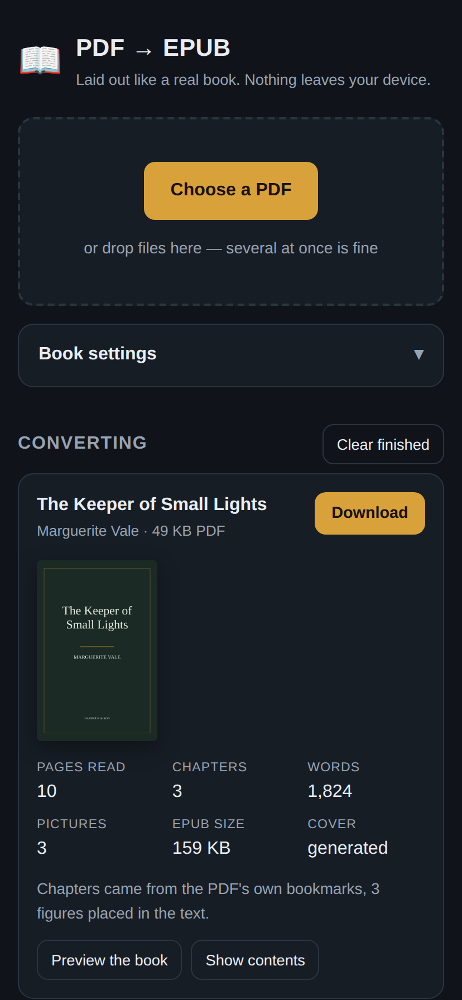
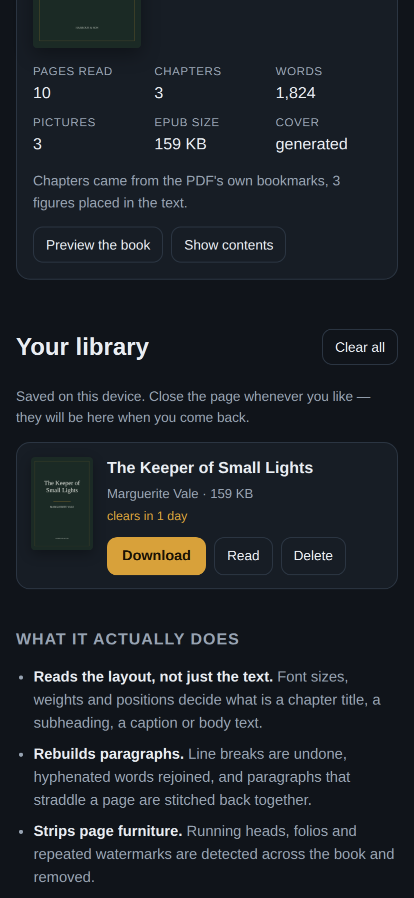
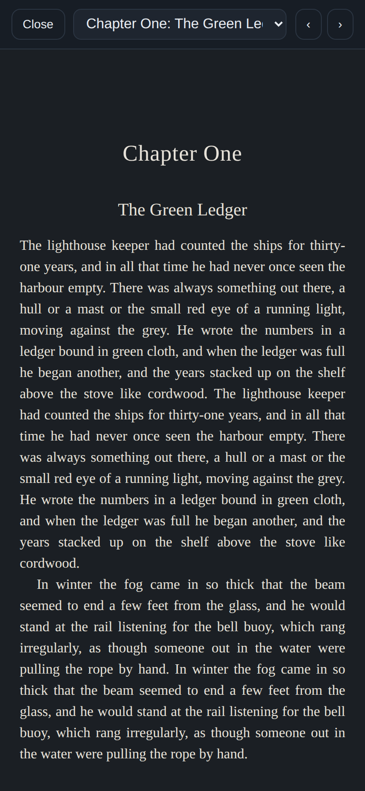

# PDF → EPUB

Turn a PDF into an EPUB that actually reads like a book — a cover, a title page,
real chapters, pictures where they belong, and typography with indents, drop caps
and a justified measure.

It runs entirely in the browser. Your file is never uploaded: the parsing, the
layout analysis and the EPUB packaging all happen on your own device, and once
the page has loaded it works with no network at all.

| See what it found | Waiting for you later | Read it before you download |
|---|---|---|
|  |  |  |

## Use it on a phone

1. Open the hosted app (see **Releases**, or your own Pages deployment).
2. Tap **Choose a PDF**, or share a PDF into the app from Files, Drive or a mail
   attachment once it is installed.
3. Tap **Download** — the EPUB lands in your Files/Downloads, ready to open in
   Apple Books, Google Play Books, KOReader, Moon+ Reader, Calibre or Kindle
   (via *Send to Kindle*).

Use **Add to Home screen** (Safari) or **Install app** (Chrome) and it behaves
like an installed app: its own icon, full screen, and it keeps working offline.
It also registers as a PDF share target on Android, so PDFs can be sent straight
to it from any other app.

## What it actually does

Most converters dump the text layer into one long HTML file. This one reads the
page the way a compositor laid it out.

- **Structure from the layout.** Every glyph carries a size, a font and a
  position. Body size is the weighted mode of the document; anything set larger,
  bolder, or centred and short becomes a heading, and the distinct heading sizes
  are ranked into a hierarchy. Chapters come from the PDF's own bookmarks when it
  has them, and from the heading hierarchy when it does not.
- **Paragraphs, not lines.** Lines are re-joined into paragraphs using the
  indent, the fill of the previous line and the leading. Words broken across a
  line are rejoined, and a paragraph interrupted by a page break is stitched back
  together.
- **Page furniture removed.** Running heads, folios and repeated watermarks are
  found by looking at what recurs in the margins across the whole book — and by
  noticing when a line in the margin merely echoes one of the book's own titles.
- **Columns read in the right order.** Two-column pages are detected from the
  vertical channel no glyph crosses, so the left column is read before the right
  instead of being interleaved line by line.
- **Pictures kept, furniture dropped.** Figures are located in the page's drawing
  operations — including charts drawn as vectors — and cut out of a print
  resolution render, so masks and overlays survive. Captions are attached to the
  figure they belong to, and images that repeat on most pages (logos, watermarks)
  are dropped.
- **A real book at the end.** Cover, title page, one file per chapter, a working
  table of contents (EPUB 3 nav *and* an NCX for older readers), footnotes
  gathered at the end of their chapter, and a stylesheet with drop caps, scene
  breaks and proper figure treatment.

Scanned PDFs with no text layer are detected and turned into a page-image EPUB,
with a note telling you to run OCR first if you want selectable text.

## Your library

Converted books are kept on the device, so the page can be closed as soon as a
conversion finishes and the EPUB will still be there later. Each one shows how
long it has left; by default they clear themselves after a day, and that can be
set to six hours, three days, or never in **Book settings**.

The conversion itself needs the page open — it runs in the browser, and takes
seconds for a novel — but nothing after that does.

### The passcode lock

Switching on **Passcode lock** encrypts every saved book with a key derived from
the passcode (PBKDF2-SHA256, 250,000 rounds → AES-GCM-256). The passcode is
never stored: only a random salt and a short verifier are, so a wrong passcode is
refused by the cipher itself rather than by a check that could be bypassed. With
the lock on, the browser's own storage inspector shows nothing but ciphertext —
no titles, no covers, no files.

Two things this deliberately is not:

- **It is not an account.** There is no server, so the library lives in this
  browser on this device. It will not follow you to another phone or another
  browser.
- **It is not recoverable.** Nobody, including this app, can decrypt the books
  without the passcode. Forget it and the only way forward is to clear the
  library and convert again.

## Settings

| Setting | What it changes |
|---|---|
| Typeface | Serif (book), sans serif, or leave it to the reader |
| Cover | Automatic, the PDF's first page, a designed cover from the title, or none |
| Chapters from | Automatic, the PDF's bookmarks, detected headings, or one long chapter |
| Picture quality | Resolution figures are cut at — compact, standard or high |
| Justified text, drop caps | Print conventions, on by default |
| Keep books for | How long the library holds a book: 6 hours, a day, three days, or until deleted |
| Passcode lock | Encrypts saved books on this device and asks for the passcode on return |
| Include pictures / charts and diagrams | Photographs, and separately, vector artwork |

## Running it yourself

```bash
npm install
npm run dev        # http://localhost:5173
npm run build      # static site in dist/
```

`dist/` is a plain static site — host it anywhere, or serve it locally with
`python3 -m http.server` (browsers will not run it from `file://`).

## Tests

```bash
npm run sample     # regenerate the fixture PDFs (needs python3 + reportlab)
npm test           # convert both fixtures in a real browser, check the EPUBs,
                   # then exercise the library, the lock and expiry
```

The suite drives the built app in headless Chromium, converts two deliberately
awkward PDFs, and then verifies the output: that the archive is a valid OCF
container, that every XHTML document is well-formed, that the manifest, spine and
table of contents all resolve — and, on the reference fixture, that the title and
author were recovered, running heads and page numbers are gone, lines were
rejoined into paragraphs, hyphenation was repaired, and the figures arrived with
their captions.

The library suite converts a book, closes and reopens the page to prove it
survives, downloads it again from storage, turns on the passcode lock and
confirms the stored records hold no readable title or file, rejects a wrong
passcode, accepts the right one, and checks that books past their time are gone.

It has also been checked against a real 360-page book: 99.1% of the original
text's five-word sequences survive the round trip, with every running head and
page number removed.

## How it is put together

```
src/engine/     framework-free conversion pipeline
  layout.js       text items -> styled lines; column gutters; graphics operators
  analyze.js      lines -> blocks -> a semantic book (headings, paragraphs, ...)
  images.js       figure regions, rendering, de-duplication
  meta.js         title, author, publisher, generated cover
  library.js      IndexedDB store for finished books, with expiry
  vault.js        passcode -> AES-GCM key; encrypt/decrypt helpers
  shelf.js        saving, listing and re-keying the library
  epub.js         EPUB 3 packaging
  zip.js          ZIP writer (stored mimetype, deflate for the rest)
  unzip.js        ZIP reader, used by the in-app preview
  convert.js      orchestration and progress reporting
src/ui/         React interface
```

The engine has no DOM dependencies beyond `<canvas>` for image work, so most of
it can be exercised straight from Node — see `test/debug.mjs`, which prints the
block and node stream for any PDF.

Built on [pdf.js](https://mozilla.github.io/pdf.js/) (Apache 2.0).

## Limitations

- Scanned pages need OCR first; this tool does not do OCR.
- Tables are captured as images when drawn with rules, and read as text
  otherwise — they are not rebuilt as `<table>`.
- Encrypted or DRM-protected PDFs cannot be opened.
- Very heavy PDFs are limited by your device's memory, since everything is done
  locally.

## License

MIT — see [LICENSE](LICENSE).
